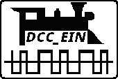
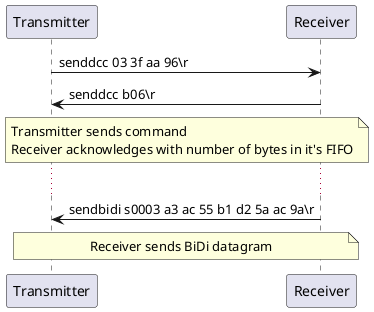

# DCC_EIN

[](https://github.com/ZIMO-Elektronik/DCC_EIN/actions/workflows/build.yml) [](https://github.com/ZIMO-Elektronik/DCC_EIN/actions/workflows/tests.yml)



DCC_EIN is a serial ASCII protocol used by the [ZIMO Sound Programmer](http://www.zimo.at/web2010/products/zsp_zimo-sound-programmer.htm). This C++ library of the same name contains code to either encode the binary data into an ASCII string or vice versa to encode the ASCII string back into binary data. The protocol is currently supported by the following products:
- Command stations
  - [ZIMO MXULF](http://www.zimo.at/web2010/products/InfMXULF.htm)

<details>
  <summary>Table of contents</summary>
  <ol>
    <li><a href="#protocol">Protocol</a></li>
    <li><a href="#getting-started">Getting started</a></li>
      <ul>
        <li><a href="#prerequisites">Prerequisites</a></li>
        <li><a href="#installation">Installation</a></li>
        <li><a href="#build">Build</a></li>
      </ul>
    <li><a href="#usage">Usage</a></li>
  </ol>
</details>

## Protocol


## Getting started
### Prerequisites
- C++23 compatible compiler
- [CMake](https://cmake.org/) ( >= 3.25 )

### Installation
This library is meant to be consumed with CMake.

```cmake
# Either by including it with CPM
cpmaddpackage("gh:ZIMO-Elektronik/DCC_EIN@0.0.1")

# or the FetchContent module
FetchContent_Declare(
  DCC
  GIT_REPOSITORY https://github.com/ZIMO-Elektronik/DCC_EIN
  GIT_TAG v0.0.1)

target_link_libraries(YourTarget INTERFACE DCC_EIN::DCC_EIN)
```

### Build
If the library is built locally then the tests and small example will be generated.
```sh
cmake -Bbuild
cmake --build build --target DCC_EINExamples
```

## Usage